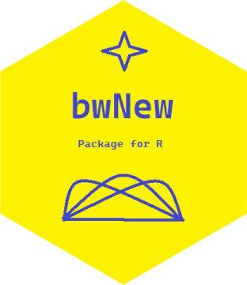

# bwNew 
Collection of functions to find Optimal Bandwidth for Kernel Density Estimation using new methods based on K-Fold Maximum Likelihood and AIC. 
This is the outcome of the project done by me under my respected professor Dr. Deepayan Sarkar at ISID. 

Install the package using the following R code.
```{r,eval = F}
   devtools::install_github("ShrayanRoy/bwNew")
```

This package consists of two functions -  `Optimal.KDE_ML` and `Optimal.KDE_AIC`. The first one uses the **K-Fold Maximum Likelihood Method** for finding optimal h 
and the second one uses the **AIC-based method**. These methods are inspired by **regression** and are prepared in an intuitive manner.You can get more details in 
`report` folder.
